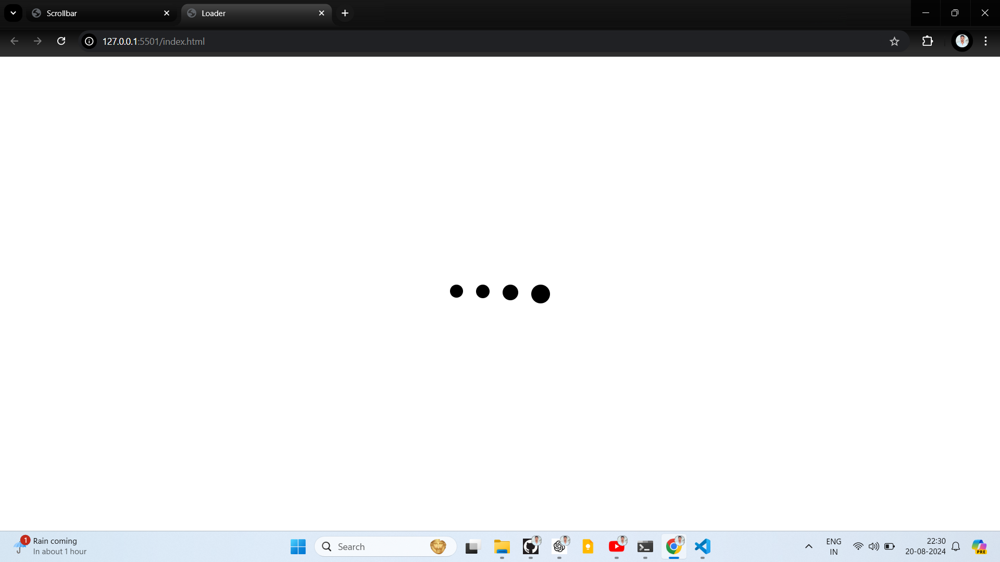

This project is a simple HTML and CSS-based loader animation designed to be centered within a webpage. The loader consists of four circles (or dots) that animate in a sequence to create a pulsing effect, giving the appearance of a loading indicator.

Project Breakdown:
1. HTML Structure:
DOCTYPE and Metadata: The document is defined with <!DOCTYPE html>, and it includes metadata like charset and viewport settings to ensure proper rendering and responsiveness across different devices.
Title: The page title is set to "Loader".
Link to CSS: The external CSS file (style.css) is linked within the <head> tag.
Section and Loader: The main content is wrapped inside a <section> element with the class center-container, which holds the loader div. Inside the loader, there are four div elements, each representing a loading dot.
2. CSS Styling:
Global Styles (* and body): Basic reset is applied to remove default margins and paddings across elements, ensuring consistent box-sizing. The body's background color is set to white.

Centering Content (.center-container):

The center-container is styled to center its content both vertically and horizontally within the viewport using display: flex, justify-content: center, and align-items: center.
The height of the container is set to 100vh, making it span the entire height of the viewport.
Loader Styles (.loader and .loading):

Loader Container: The loader itself is a flex container with space-evenly distributed elements (the dots).
Loading Dots: Each loading dot is a black, circular div with a fixed size of 30px by 30px and a border-radius of 50% (to make it a circle). These dots are spaced evenly with margin and animate using a keyframe animation called loader.
Animation:

Keyframes (@keyframes loader): The loader animation is defined to shrink the dots from 30px to 20px in size and then return to 30px, creating a pulsing effect. The animation runs infinitely with a timing of 0.8s and is eased-in and out for smooth transitions.
Animation Delay: Each dot is given a different animation delay (.one, .two, .three) to create a staggered effect, enhancing the visual appearance of loading.
Explanation of Functionality:
When the page is loaded, the four dots in the loader animate in a sequential pulsing manner. This gives the impression of an ongoing process, like loading content or data. This loader can be used as a placeholder while waiting for content to load on a webpage, providing users with visual feedback that the system is working.

The project effectively uses CSS animations and flexbox layout techniques to create a visually appealing and functional loading animation without the need for JavaScript, making it lightweight and easy to implement in various web projects.